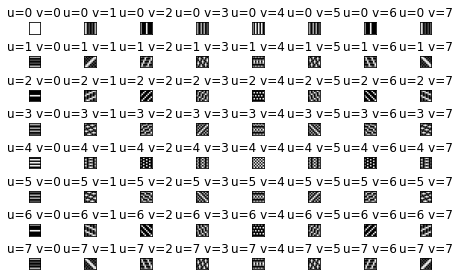
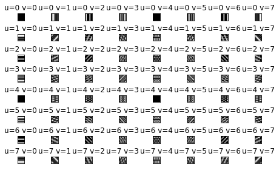

# Basis Vectors of 2-D Discrete Fourier Transform (8 * 8)

## Abstraction
Assume 2-D Discrete Fourier Transform of a 8 * 8 image, plot all the basis vectors of 2-D Discrete Fourier Transform (before translation), and associate the 2-D DFT basis vectors with frequencies.

## Methods and Materials
For each combination of u and v, calculate the gray value of each pixel to get the result.


```python
from math import cos
from math import sin
from math import pi
import numpy as np
import matplotlib.pyplot as plt

for u in range(8):
    for v in range(8):
        RealImage = []
        ImagineImage = []
        for x in range(8):
            realRowPixels = []
            imagineRowPixels = []
            for y in range(8):
                realRowPixel = cos(2 * pi * (u * x + v * y) / 8) * 255
                imagineRowPixel = sin(2 * pi * (u * x + v * y) / 8) * 255
                realRowPixels.append(realRowPixel)
                imagineRowPixels.append(imagineRowPixel)
            RealImage.append(realRowPixels)
            ImagineImage.append(imagineRowPixels)
        #实部基矢量
        name = 'u=' + str(u) + ' v=' + str(v)
        plt.figure(1)
        vector = np.array(RealImage, np.uint8)
        plt.tight_layout()
        plt.subplots_adjust(wspace=2, hspace=2)
        plt.subplot(8, 8, v + 8 * u + 1)
        plt.imshow(vector, cmap='gray', vmin=0, vmax=255)
        plt.title(name)
        plt.xticks([])
        plt.yticks([])
        # 虚部基矢量
        plt.figure(2)
        vector = np.array(ImagineImage, np.uint8)
        plt.tight_layout()
        plt.subplots_adjust(wspace=2, hspace=2)
        plt.subplot(8, 8, v + 8 * u + 1)
        plt.imshow(vector, cmap='gray', vmin=0, vmax=255)
        plt.title(name)
        plt.xticks([])
        plt.yticks([])
plt.show()

```

​    

## Results

Real part and imaginary part are as follows:


    



    

